# Heritage

<div align="center">
  <h3>🔐 Decentralized Dead Man's Switch Protocol on Sui</h3>
  <p>Secure digital inheritance system with cryptographic secret sharing</p>
  
  
  
  
  
  
  
  
  
</div>

---

## 🚀 Production-ready Digital Inheritance Protocol on Sui Network

Heritage is a sophisticated decentralized solution that automatically transfers digital assets (SUI funds + encrypted secrets) to designated heirs if the owner stops sending "heartbeats" for a predetermined period. Built with enterprise-grade security using Shamir's Secret Sharing and deployed on Sui's high-performance blockchain.

## 🔧 Technology Stack

### High-Level Architecture

```mermaid
graph LR
    A[👤 Owner] --> B[🔐 AES Encrypt Secret]
    B --> C[🔀 Split Key into 5 Shares]
    C --> D[� Walrus Storage]
    C --> E[🌐 Sui Network]
    
    D --> F[📦 Share #2 Backup]
    E --> G[💎 Legacy Vault]
    
    G --> H[� Encrypted Shares 3,4,5]
    G --> I[⏰ Heartbeat Timer]
    G --> J[� SUI Balance]
    
    K[👥 Beneficiary] --> L[🔓 Claim After Timeout]
    L --> M[🧩 Combine Shares]
    M --> N[🔑 Recover AES Key]
    N --> O[📜 Decrypt Secret]
    
    style A fill:#e1f5fe
    style D fill:#fce4ec
    style E fill:#f1f8e9
    style K fill:#e8f5e8
```



### Smart Contracts & Development

| Technology | Version | Purpose |
|------------|---------|---------|
| **Sui Move** | 2024.beta | Smart contract language |
| **Sui Framework** | testnet | Blockchain development framework |
| **@mysten/sui** | 1.0.0 | Sui TypeScript SDK |
| **@mysten/dapp-kit** | 0.14.0 | DApp connection & wallet integration |
| **@mysten/walrus** | 0.2.2 | Decentralized storage protocol |

### Frontend & Development

| Technology | Version | Purpose |
|------------|---------|---------|
| **React** | 18.3.1 | UI framework |
| **TypeScript** | 5.6.2 | Type-safe development |
| **Vite** | 5.4.10 | Build tool & dev server |
| **TailwindCSS** | 3.4.0 | Utility-first CSS framework |
| **Framer Motion** | 11.0.0 | Animation library |
| **React Router** | 6.20.0 | Client-side routing |

### Cryptography & Security

| Technology | Version | Purpose |
|------------|---------|---------|
| **secrets.js-grempe** | 2.0.0 | Shamir's Secret Sharing (5-3) |
| **TweetNaCl** | 1.0.3 | Cryptographic primitives |
| **crypto-browserify** | 3.12.1 | Browser crypto compatibility |

### System Architecture


## 📋 Table of Contents
- [Live Deployment](#-live-deployment)
- [Features](#-features)  
- [How It Works](#-how-it-works)
- [Prerequisites](#-prerequisites)
- [Setup & Run](#-setup--run)
- [Environment Variables](#-environment-variables)
- [Frontend Commands](#-frontend-commands)
- [Flows](#-flows)
- [Sui Move Smart Contract](#-sui-move-smart-contract)
- [Storage (Walrus)](#-storage-walrus)
- [Security Notes](#-security-notes)
- [License](#-license)

## 🌐 Live Deployment

### 📜 Transaction Proof
**Verified Transaction:** [`0x1d61aeea5e3cad7fb0906e6434d0932a732c36b19a27422af07dbc800bdb6c9f`](https://suiscan.xyz/testnet/tx/37UVcvFLRMF1uWWvjjxB1LytNMNXeDNbe7Hu1jBNLfm7)

### 🏗️ Smart Contracts on Sui

| Contract | Address | Status |
|----------|---------|--------|
| **Heritage Package** | [`0x70c3b603ac8b7b75f35be375a96ac141ae0550a393911a78dbf2528f8be5ed75`](https://suiscan.xyz/testnet/object/0x70c3b603ac8b7b75f35be375a96ac141ae0550a393911a78dbf2528f8be5ed75) | ✅ Deployed |
| **Module: vault** | [`heritage::vault`](https://suiscan.xyz/testnet/object/0x70c3b603ac8b7b75f35be375a96ac141ae0550a393911a78dbf2528f8be5ed75) | ✅ Verified |

## ✨ Features
- **Legacy Creation**: Owner encrypts the secret with AES, splits the key into 5 shares (5-3 threshold)
- **Walrus Integration**: Encrypted payload and shares stored on Walrus; on-chain only unusable single shares + references
- **Heartbeat System**: Owner refreshes lock before timeout with "I'm Alive" mechanism
- **Claim Flow**: After timeout, heir combines shares to decrypt the secret
- **SuiNS Support**: Beneficiary field resolves `.sui` / `.sol` names automatically
- **Direct RPC**: Testnet uses `https://fullnode.testnet.sui.io:443` by default (no proxy)

## 🔄 How It Works


### Process Flow:
1. **Create**: Owner types a secret, picks an unlock timer, sets the heir address (or SuiNS name)
2. **Protect**: The secret is encrypted in the browser and sliced into pieces; a backup piece is stored on Walrus, the rest are locked to the heir
3. **Stay alive**: Owner clicks "I'm Alive" in the dashboard to keep the vault locked
4. **Claim**: When the timer expires, the heir claims on-chain and pastes their share; the app reunites the pieces and shows the decrypted secret

## 🛠 Prerequisites
- Node.js ≥ 18
- npm (repo uses `package-lock.json`)
- Sui CLI (for contract build/test)

## 🚀 Setup & Run
From repo root:
```bash
# Install dependencies
npm install

# Start frontend development server
npm run dev

# Build for production
npm run build

# Build smart contract
npm run build:contract

# Run contract tests
npm run test:contract
```

## 🔧 Environment Variables
For frontend (`apps/web`) in `.env.local`:
```bash
# Optional: custom RPC, else public testnet is used
VITE_SUI_RPC_URL=https://fullnode.testnet.sui.io:443

# Optional: package ID overrides
VITE_PACKAGE_ID_TESTNET=0x70c3b603ac8b7b75f35be375a96ac141ae0550a393911a78dbf2528f8be5ed75
VITE_PACKAGE_ID_MAINNET=0x...
VITE_PACKAGE_ID_DEVNET=0x...

# Optional: Walrus aggregator override
VITE_WALRUS_AGGREGATOR_URL=https://aggregator.walrus-testnet.walrus.space
```

## 💻 Frontend Commands
(From root or within `apps/web`)
```bash
npm run dev      # Vite dev server
npm run build    # tsc -b && vite build
npm run lint     # eslint .
```

## 🌊 Application Flows

### 1) 🔐 Legacy Creation (`CreateLegacyPage.tsx`)
```
📝 Owner Input → 🔑 AES Encryption → 🔀 5-Share Split → 🐋 Walrus Upload → 🌐 Vault Creation
```
- **Step 1**: Generate 256-bit AES key and encrypt secret note
- **Step 2**: Split AES key using Shamir's Secret Sharing (5-3 threshold) 
- **Step 3**: Upload encrypted secret blob to Walrus network
- **Step 4**: Upload Share #2 to Walrus as public backup
- **Step 5**: Encrypt Shares 3,4,5 with beneficiary's NaCl public key
- **Step 6**: Create `LegacyBox` on Sui with encrypted shares and timer
- **SuiNS Integration**: Beneficiary addresses auto-resolve `.sui`/`.sol` domains

### 2) 💓 Heartbeat Maintenance (`DashboardPage.tsx`) 
```
📊 Dashboard → 💓 "I'm Alive" → ⏰ Timer Reset → 🔄 Repeat
```
- **Owner Dashboard**: View all created vaults with status
- **Heartbeat Signal**: Call `im_alive()` to reset unlock timer
- **Fund Management**: Add more SUI to vaults or cancel/withdraw
- **Status Monitoring**: Track time remaining until claim becomes available

### 3) 🎯 Legacy Claiming (`ClaimPage.tsx`)
```
🔍 Search Vault → ⏰ Wait Timeout → 🎯 Claim → 🔓 Decrypt → 📜 Secret
```
- **Vault Discovery**: Search by vault ID or scan beneficiary events
- **Claim Execution**: Call `claim_legacy()` after timeout period  
- **Share Collection**: Retrieve encrypted shares from claim event
- **Decryption Process**: Decrypt shares using heir's private key
- **Secret Recovery**: Combine 3+ shares to reconstruct AES key and decrypt blob

## 📜 Sui Move Smart Contract (`heritage::vault`)

### Core Data Structure - `LegacyBox`:
```move
public struct LegacyBox has key, store {
    id: UID,                           // Unique object identifier
    owner: address,                    // Creator who can send heartbeats  
    beneficiary: address,              // Heir who can claim after timeout
    unlock_time_ms: u64,              // Duration in ms before claim possible
    last_heartbeat: u64,               // Last heartbeat timestamp
    encrypted_blob_id: String,         // Walrus blob ID for encrypted secret
    locked_shares: vector<String>,     // Encrypted SSS shares (3,4,5)
    balance: Balance<SUI>,             // Locked SUI funds for inheritance
}
```

### Entry Functions:
| Function | Caller | Purpose | Parameters |
|----------|--------|---------|------------|
| `create_vault` | Owner | Create new legacy vault | `beneficiary`, `unlock_time_ms`, `blob_id`, `shares`, `coin` |
| `im_alive` | Owner | Reset heartbeat timer | `vault`, `clock` |
| `claim_legacy` | Beneficiary | Claim after timeout | `vault`, `clock` |
| `add_funds` | Owner | Increase vault balance | `vault`, `coin` |
| `cancel_legacy` | Owner | Withdraw and destroy | `vault` |

### Events Emitted:
- `VaultCreated` → New vault successfully created
- `HeartbeatUpdated` → Owner sent heartbeat signal  
- `LegacyClaimed` → Heir claimed vault (contains encrypted shares)
- `VaultCancelled` → Owner cancelled and withdrew funds

### Build Commands:
```bash
cd apps/contract
npm run build   # Sui Move compilation
npm run test    # Run Move unit tests
```

## 🐋 Walrus Decentralized Storage

### Data Storage Strategy:
Heritage leverages Walrus for secure, redundant storage of sensitive components:

| Data Type | Location | Purpose | Accessibility |
|-----------|----------|---------|---------------|
| **Encrypted Secret Blob** | Walrus | AES-encrypted original secret | Public (useless without key) |
| **Share #2 Backup** | Walrus | Plaintext SSS share for recovery | Public (1/3 threshold, safe alone) |
| **Shares #3,4,5** | Sui Contract | NaCl-encrypted for heir | Private (event-emitted on claim) |

### SDK Implementations:

#### 1. Simple SDK (`walrus-sdk.ts`)
```typescript
// Direct REST API calls to Walrus network
PUT  /v1/blobs?epochs=1          // Store blob
GET  /v1/blobs/{blobId}          // Retrieve blob  
```

#### 2. Advanced Integration (`walrus.ts`)  
```typescript
// Full SDK with enhanced features
- Dynamic Walrus SDK loading from CDN
- Multiple aggregator fallback endpoints  
- Upload relay with retry logic
- Default storage: 5 epochs (~1 year retention)
- WASM runtime via jsDelivr CDN
```

### Network Configuration:
- **Testnet Publisher**: `https://publisher.walrus-testnet.walrus.space`
- **Testnet Aggregator**: `https://aggregator.walrus-testnet.walrus.space` 
- **Mainnet Publisher**: `https://publisher.walrus.walrus.space`
- **Mainnet Aggregator**: `https://aggregator.walrus.walrus.space`

## 🔒 Security Notes
- **Client-Side Encryption**: Secrets never sent in plaintext
- **Shamir 5-3 Threshold**: Single shares are useless alone
- **Public Key Cryptography**: If encrypted with heir's public key, matching private key required to decrypt
- **Direct RPC**: Public testnet/fullnode RPC used; no proxy required

## 📁 Project Structure
```
heritage/
├── apps/
│   ├── contract/         # Sui Move smart contract
│   │   ├── sources/
│   │   │   └── vault.move
│   │   ├── tests/
│   │   └── Move.toml
│   └── web/              # React + Vite frontend
│       ├── src/
│       │   ├── components/
│       │   ├── hooks/
│       │   ├── pages/
│       │   ├── services/
│       │   └── utils/
│       └── package.json
├── packages/tsconfig/    # Shared TS configs
└── package.json          # Root scripts
```

## 📄 License
MIT - see LICENSE file for details

---

<div align="center">
  <p>Built with ❤️ for the Sui ecosystem</p>
  <p>
    <a href="https://sui.io">Sui Network</a> • 
    <a href="https://walrus.site">Walrus Storage</a> • 
    <a href="https://suiscan.xyz">Suiscan Explorer</a>
  </p>
</div>